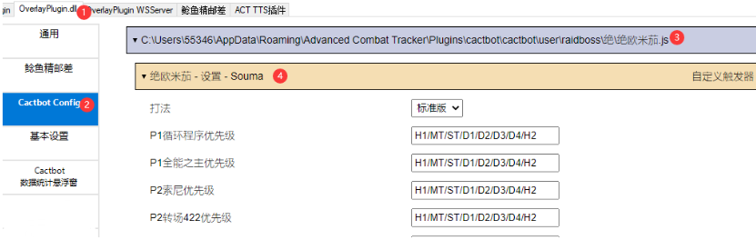

# raidboss-user-js-public

## 用户须知

在使用任何第三方程序之前，请您明白这违反了官方规定，同时也要确认您愿意自行承担因使用程序可能产生的任何后果。

在野队中，如果您使用鲶鱼精邮差来发送小队信息，将被视为不再需要您的游戏账号。

## 安装

### 依赖

1. 请确保 [Cactbot](https://github.com/OverlayPlugin/cactbot/) Raidboss 悬浮窗正常工作。
1. 您需要在 OverlayPlugin 插件中添加 职业分配悬浮窗 `https://souma.diemoe.net/ff14-overlay-vite/#/cactbotRuntime`，在进入副本后，在需要优先级的副本中正确设置每个人的职业位置。
1. （可选）如果您需要开启标点等操作，可以加载正确版本的 [鲶鱼精邮差](https://github.com/Natsukage/PostNamazu/releases)。

### 方式一：下载器

适合连不上 Github 的宝宝们使用。

1. 下载 [Souma 下崽器](https://github.com/Souma-Sumire/SoumaDownloader/releases/latest)，并在 ACT 中加载。
1. 勾选所需文件，然后点击 [下载/更新] 按钮。程序会自动检测您的 user 文件夹，并为您下载最新的文件。
1. 刷新 Raidboss 悬浮窗，即可成功加载。

优点：文件通过呆萌服务器进行下载。

缺点：自动更新可能会使您感到担忧。

如果您对源码进行了修改，请把修改过的文件丢到其他文件夹里，不要使用下崽器对他进行更新，否则会覆盖掉您的改动。

### 方式二：手动下载

适合熟练控制计算机的大宝宝们。

1. 手动点击右上角下载或克隆本仓库。
1. 将相应文件放入您的 Cactbot User 文件夹。例如 `D:\ACT.DieMoe\Plugins\ACT.OverlayPlugin\cactbot\user\raidboss\Souma\零式 - p9s.js`
1. 刷新 Raidboss 悬浮窗，即可成功加载。

优点：本地文件完全受您掌控。

缺点：获取更新可能不及时。

## Cactbot User 文件夹在哪？

## Cactbot User JS 如何修改配置？

## 适用副本

### 零式

- P1S：通用
- P2S：无
- P3S：无
- P4S：被窝攻略（标点需要邮差）
- P5S：无
- P6S：千星（标点需要邮差）
- P7S：四风标点（标点需要邮差）
- P8S：菓子（青瓜）（标点需要邮差）
- P9S：game8
- P10S：game8
- P11S：game8、可选美服 uptime 调停
- P12S：菓子、game8，可选 NGA 固定黑白塔，美服 1 风火

### 绝境战

- 神兵：三连桶标点（标点需要邮差）
- 龙诗：莫古力全套（标点需要邮差）
- 欧米茄： [腾讯文档](https://docs.qq.com/doc/DTXZHb1lXcUZ4eXBh)（标点需要邮差）

## 其他注意事项

- 进入战斗之前，请确保已启动 ACT。
- 小队内不得存在重名玩家。
- 不能保证与其他作者的同副本 JS 文件兼容。
- 悬浮窗排序与小队列表的显示顺序无关。
- JS 与 Triggernometry 或 MoreLog 插件无关。（MoreLog 又名 CactbotSelf，但它与 Cactbot 官方无关，这种命名方式可能让普通用户感到困惑）

## 反馈

- 2 群：231937107
