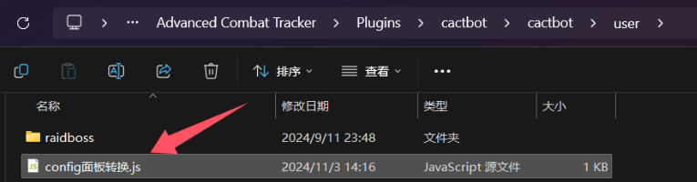
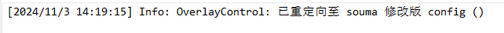

## 7.0 之后的更新

## 国服特供公告

如果你在国服出现了大部分机制不报的情况，说明你的 ACT 读取到了上一个版本的缓存。

你需要：点开 `DevTools`，跳转至 `Network` 选项卡，勾选 `Disable cache`，然后按 F5 进行强制刷新。

## 使用

</img>

### 咖啡 ACT 整合

在咖啡 ACT 整合中，Raidboss 悬浮窗的默认标签名称是 `时间轴 (cactbot)`，请你将其的悬浮窗地址修改为 **<https://souma.diemoe.net/cactbot/ui/raidboss/raidboss.html>**

*该默认名称具有极大的误导性，实际上 Raidboss 是时间轴 + 触发器。*

### 呆萌 ACT 整合

在呆萌ACT整合中，Raidboss 悬浮窗默认被分成了两部分，他们是：

- 名称【时间轴】，地址是
`file://此处省略/raidboss.html?timeline=1&alerts=0`，
请你将其修改为 **<https://souma.diemoe.net/cactbot/ui/raidboss/raidboss.html?timeline=1&alerts=0>**

- 名称【触发器提示】，地址是 `file://此处省略/raidboss.html?timeline=0&alerts=1`，请你将其修改为 **<https://souma.diemoe.net/cactbot/ui/raidboss/raidboss.html?timeline=0&alerts=1>**

### 与原版 Raidboss 的区别

在原版基础上进行了一些个性化修改，包括：

- 阿卡狄亚零式登天斗技场
- 光暗未来绝境战

在 M1S ~ M3S 中，仅一些细节改动，并没有太大变化。

在 M4S，采用我首次周编写的个人风格的 TTS 报法 + 部分机制写死为 Game8 攻略站位。[查看与原版对比](https://docs.qq.com/doc/DTXFVcmRrYVJVd2lk)

绝伊甸计划：莫古力一套，同样会完全忽视主分支的更新。

### 自定义配置

我们注意到，使用在线链接虽然可以极大的降低用户门槛，但也带来了新的缺陷，那就是无法自定义配置。

为了解决这个问题，我们需要通过一个简单的小脚本劫持内嵌的 config 面板。

只需要在 user/raidboss 文件夹内新建一个文本文档，并写入内容：

```javascript
if (/^file:\/\/.+\/config\/config\.html$/.test(location.href)) {
    location.href = 'http://souma.diemoe.net/cactbot/ui/config/config.html';
    console.log('已重定向至 souma 修改版 config');
}
```

然后，将这个文件的重命名为 `config面板转换.js`



当你做对了，打开配置面板时会打印一条日志。



以后当你点击 config 面板时，会自动跳转到在线版 config，此时你便可以如原生版一样进行配置了。

## 我找 6.X 以前的东西

1. [下载本仓库](https://github.com/Souma-Sumire/raidboss-user-js-public/archive/refs/heads/main.zip)
1. 将 raidboss 文件夹中 *你需要的* `.js` 文件，放入你的 `user\raidboss` 文件夹
1. （可选）存在优先级的副本，需将 `[重要] 依赖 - Souma拓展运行库.js` 文件也一并放入，并新建*数据统计*悬浮窗 <https://souma.diemoe.net/ff14-overlay-vite/#/cactbotRuntime>，以实现职能位置分配
1. （可选）使用标点功能，需要加载**正确版本**的 [鲶鱼精邮差](https://github.com/Natsukage/PostNamazu/releases)
1. 重启 ACT，使文件生效

## 常见问题

### User 文件夹在哪

- 呆萌：`ACT.DieMoe\Plugins\ACT.OverlayPlugin\cactbot\user\raidboss`
- 咖啡：`ACT.ffcafe\Plugins\cactbot-offline\user\raidboss`

### 其他

- [欧米茄标点说明](https://docs.qq.com/doc/DTXZHb1lXcUZ4eXBh)
