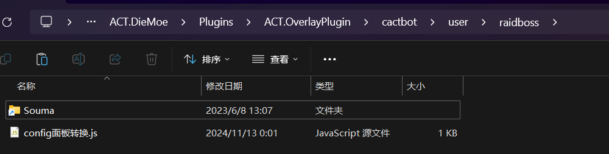

## 我找零式阿卡狄亚登天斗技场 & 光暗未来绝境战

将你原来的 Raidboss 本地地址替换为此在线链接：`https://souma.diemoe.net/cactbot/ui/raidboss/raidboss.html`

</img>

### 自定义配置

我们注意到，使用在线链接虽然可以极大的降低用户门槛，但也带来了新的缺陷，那就是无法自定义配置。

为了解决这个问题，我们需要通过一个简单的小脚本劫持内嵌的 config 面板。

只需要将 [config面板转换.js](https://raw.githubusercontent.com/Souma-Sumire/raidboss-user-js-public/refs/heads/main/config%E9%9D%A2%E6%9D%BF%E8%BD%AC%E6%8D%A2.js)，打开后 Ctrl+S 保存至 user 文件夹即可。

当你做对了，打开配置面板时会打印一条日志。如果没有打印这一条，说明你做错了，请重新检查你的操作或放弃修改。

以后当你点击 config 面板时，会自动跳转到在线版 config，此时你便可以如原生版一样进行配置了。

## 我找 6.X 以前的东西

1. [下载本仓库](https://github.com/Souma-Sumire/raidboss-user-js-public/archive/refs/heads/main.zip)
1. 将 raidboss 文件夹中 *你需要的* `.js` 文件，放入你的 `user\raidboss` 文件夹
1. （可选）存在优先级的副本，需将 `[重要] 依赖 - Souma拓展运行库.js` 文件也一并放入，并新建*数据统计*悬浮窗 <https://souma.diemoe.net/ff14-overlay-vite/#/cactbotRuntime>，以实现职能位置分配
1. （可选）使用标点功能，需要加载**正确版本**的 [鲶鱼精邮差](https://github.com/Natsukage/PostNamazu/releases)
1. 重启 ACT，使文件生效

## 常见问题

### User 文件夹在哪

- 呆萌：`ACT.DieMoe\Plugins\ACT.OverlayPlugin\cactbot\user\raidboss`
- 咖啡：`ACT.ffcafe\Plugins\cactbot-offline\user\raidboss`

### 其他

- [欧米茄标点说明](https://docs.qq.com/doc/DTXZHb1lXcUZ4eXBh)
